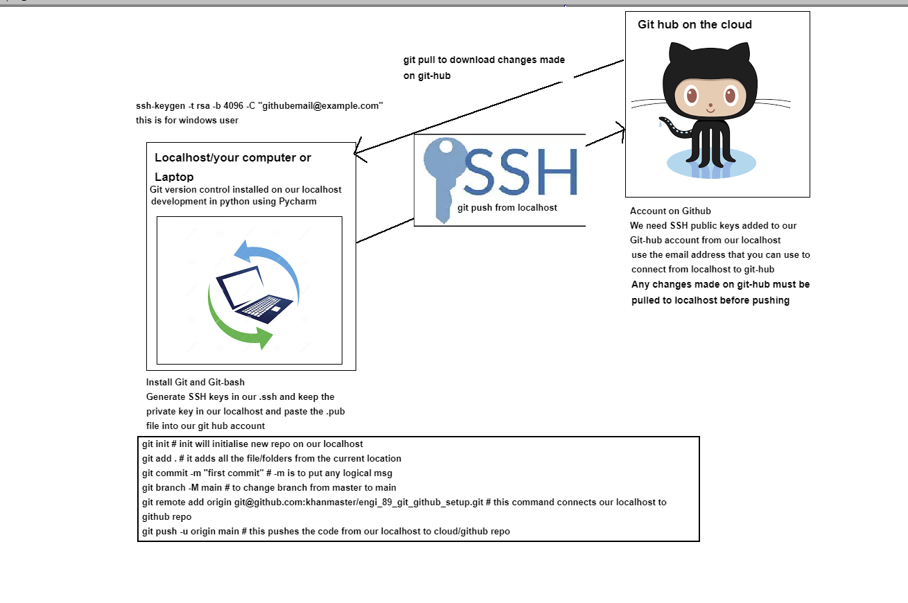

# Guide to Git and Github Setup

**This documentation will go through how to set up Git and Github.**

*Step 1: Download Git*

The first step is to download Git and Git.bash on your localhost.

Click here to download Git

*Step 2: Generate ssh key*

You must generate a ssh key to use for authentication.

- Open the terminal

- Create a .ssh directory mkdir .ssh then open the directory cd .ssh

- Now, paste the text below, ensuring to use the email associated with you Github account.

- $ ssh-keygen -t ed25519 -C "your_email@example.com"

- The Following prompts will appear. For each of these prompts press enter This should generate a public and private key pair

- Enter a file in which to save the key (/Users/you/.ssh/id_ed25519): [Press enter]

- Enter passphrase (empty for no passphrase): [Type a passphrase]

- Enter same passphrase again: [Type passphrase again]

- Copy the .pub then open Github

- When on Github, open Settings then SSH and GPG keys then click New SSH key . Now paste

*Step 3: Initializing a repo
git pull*

- `git init` To check what's added to be sent to git hub

- `git status` To ensure only required files are added to be sent

- `git add .` To add git all files or git add 'name_of_the_file'

- `git commit -m "message" `To save changes

- `git branch -M main` If you have not set remote branch to main

- `git remote add origin` [key] To Add remote to connect localhost with Github repo

 To push changes to Github
- `git reset --soft`
  * Does not touch the index file or the working tree at all (but resets the head to <commit>, just like all modes do). This leaves all your changed files "Changes to be committed", as git status would put it.
-	`git reset --hard`
	  * Resets the index and working tree. Any changes to tracked files in the working tree since <commit> are discarded. Any untracked files or directories in the way of writing any tracked files are simply deleted.
- `Git branch –b` (new branch name)
- `git config --global core.editor nano`
- `git config --get remote.origin.url`
- `git push --set-upstream origin main`
- `git pull` url
- `git remote add origin` <url>
- `git remote -v`
- `git push -u origin/main`

**Clone a specific remote branch**

- git clone --branch (branch name) (git repo link)
## For information on git and github visit this link:
https://learngitbranching.js.org/